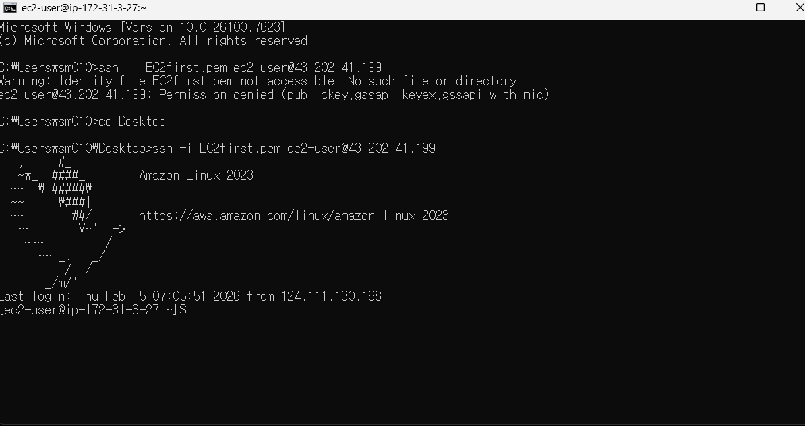

# AWS EC2 웹서버 + 로드밸런서 실습

## 📌 목표
- EC2 웹서버 구축
- ALB 로드밸런서 연결
- 트래픽 분산 테스트

## 🛠 구성
- EC2 2대
- Target Group
- Application Load Balancer

## 📋 실습 단계

### 1️⃣ EC2 접속

### 2️⃣ 로드밸런서 설정

| 설정 화면 1 | 설정 화면 2 |
|------------|------------|
|  |  |

### 3️⃣ 결과 확인

### 4️⃣ 웹 접속 성공

## ✅ 결과
- 로드밸런서를 통한 트래픽 분산 성공
