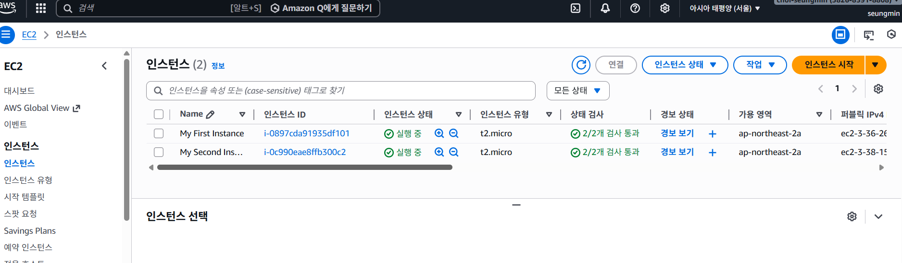

# AWS EC2 웹서버 + 로드밸런서 구축 실습

## 📌 프로젝트 목표
- EC2 웹서버 2대 구축
- SSH 원격 접속 설정
- Application Load Balancer 구성
- 트래픽 분산 테스트

---

## 🛠 사용 기술
- AWS EC2 (Amazon Linux)
- Application Load Balancer
- Target Group
- Security Group
- Nginx

---

## 📋 실습 과정

### 1️⃣ EC2 인스턴스 생성 (2대)

---

### 2️⃣ 웹 서버 접속 확인
> 각 인스턴스에 웹 서버 설치 후 접속 테스트

---

### 3️⃣ SSH 원격 접속
> 서버 환경 설정을 위한 원격 접속

---

### 4️⃣ 로드밸런서 설정
> Target Group 및 Listener 연결

| 설정 화면 1 | 설정 화면 2 |
|------------|------------|
|  |  |

---

### 5️⃣ 로드밸런싱 테스트 (새로고침)
> 새로고침 시 서버가 교차 응답하는 것을 확인

> 브라우저 새로고침 시 서버 1과 서버 2가 번갈아 응답

---

### 6️⃣ 최종 접속 결과

---

## ✅ 결과
- EC2 2대를 활용한 웹 서버 이중화 구성 완료
- ALB 기반 트래픽 분산 정상 동작
- 기본 클라우드 인프라 구조 이해

