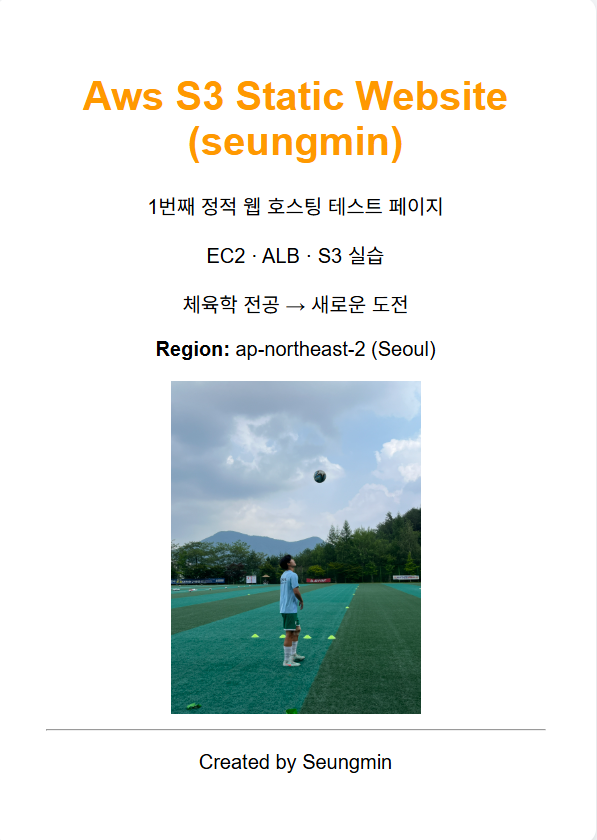

# AWS S3 정적 웹사이트 구축 실습

## 📌 프로젝트 목표
- Amazon S3 Static Website Hosting 기능 이해
- 단일 페이지 웹 사이트 배포
- 정적 웹 환경에서 리소스 경로 관리 경험

---

## 🛠 사용 기술
- AWS S3 (Static Website Hosting)
- HTML / CSS
- AWS Console

---

## 📂 버킷 구조
- index.html
- soccer.jpg

---

## 📋 결과 화면
> S3 Static Website Endpoint를 통해 접속한 결과 화면



---

## ❗ 트러블슈팅

### 문제
- `index.html` 페이지는 정상 출력
- `` 태그에 지정한 이미지가 화면에 표시되지 않음
- 이미지 Object URL 직접 접근 및 다운로드는 가능

### 원인
- HTML 코드에서 이미지 경로를 `images/soccer.jpg`로 작성
- 실제 S3 버킷에는 `images` 폴더가 존재하지 않음
- S3 정적 웹 호스팅은 객체 경로가 정확히 일치해야 리소스를 로드함

### 해결
- 실제 버킷 구조에 맞게 이미지 경로 수정
```html


---

### 느낀점
-S3 Object URL과 Static Website Endpoint의 차이를 이해함
-정적 웹 환경에서 파일 경로 관리의 중요성을 경험함
-단순 구성이라도 문제 해결 과정이 중요하다는 것을 느낌
